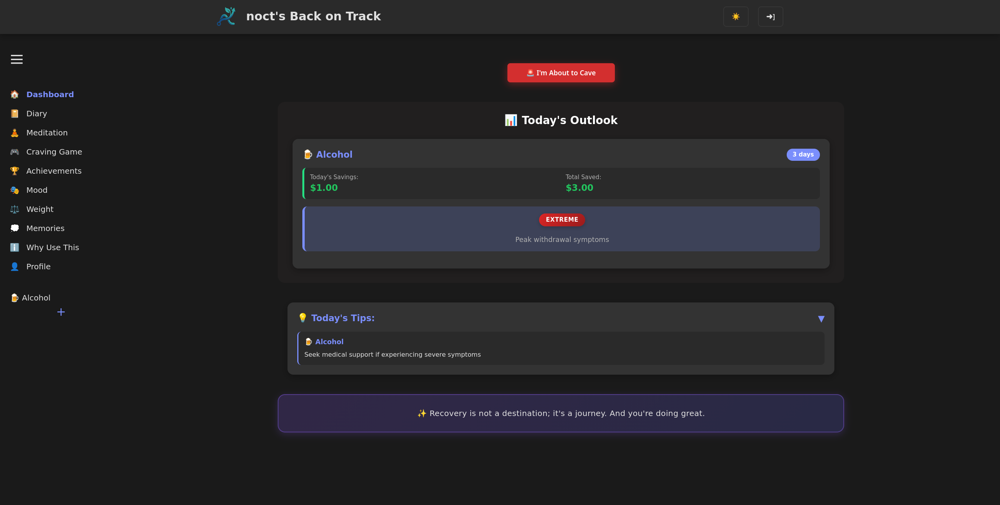
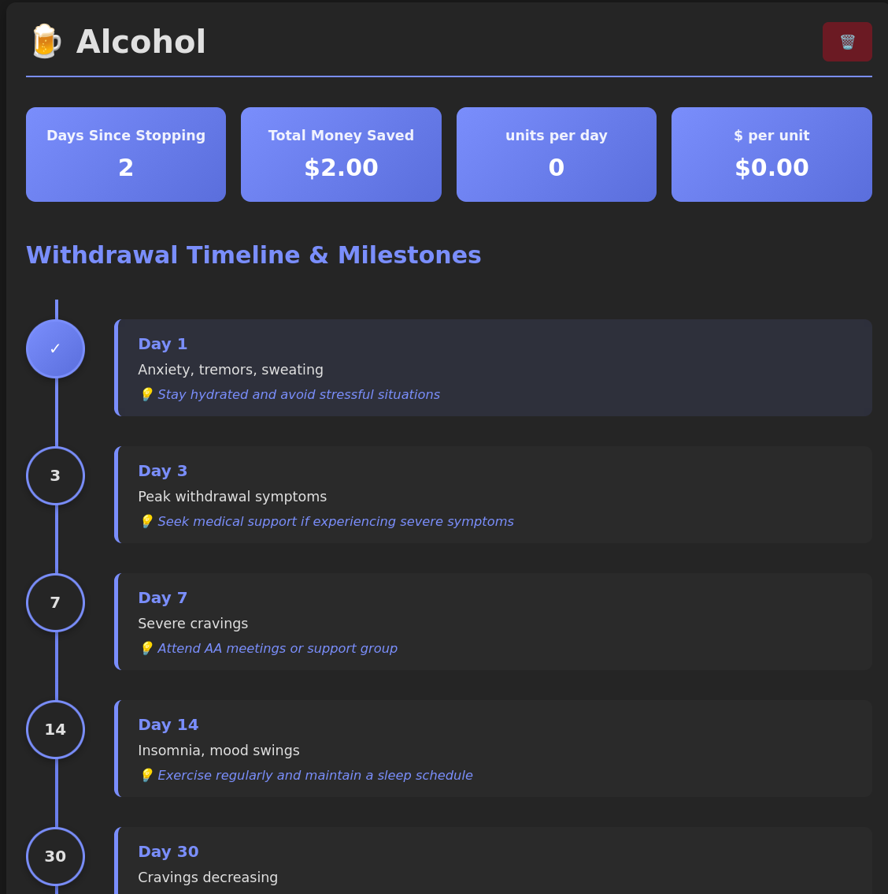
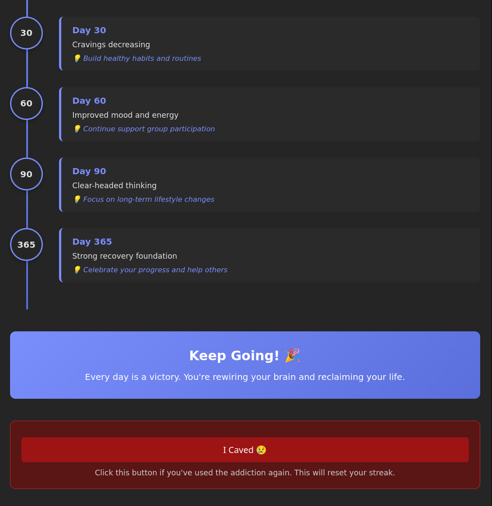
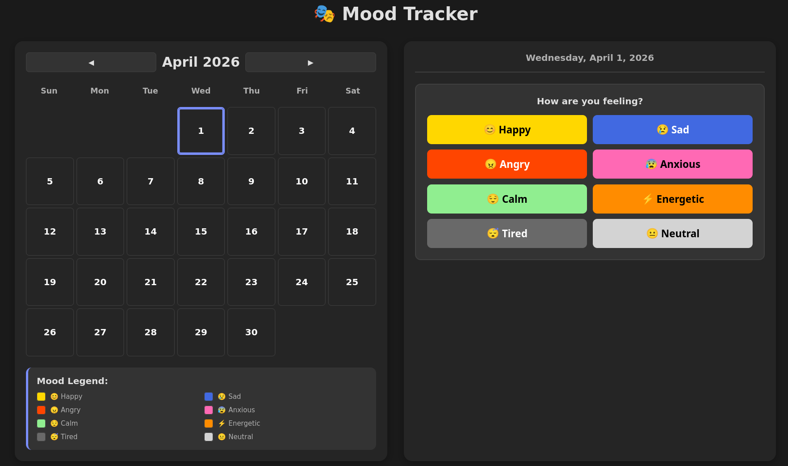
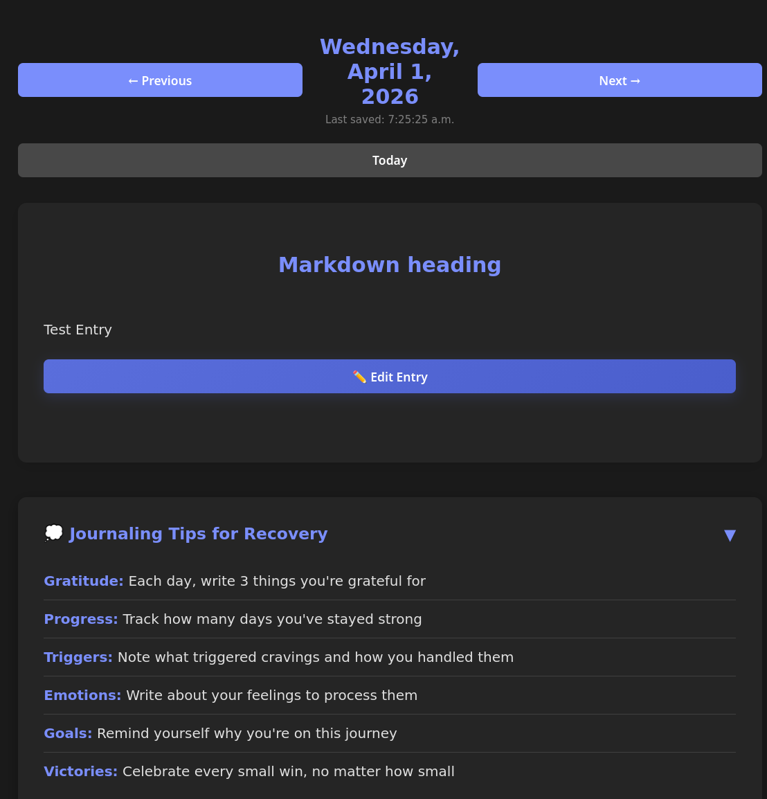
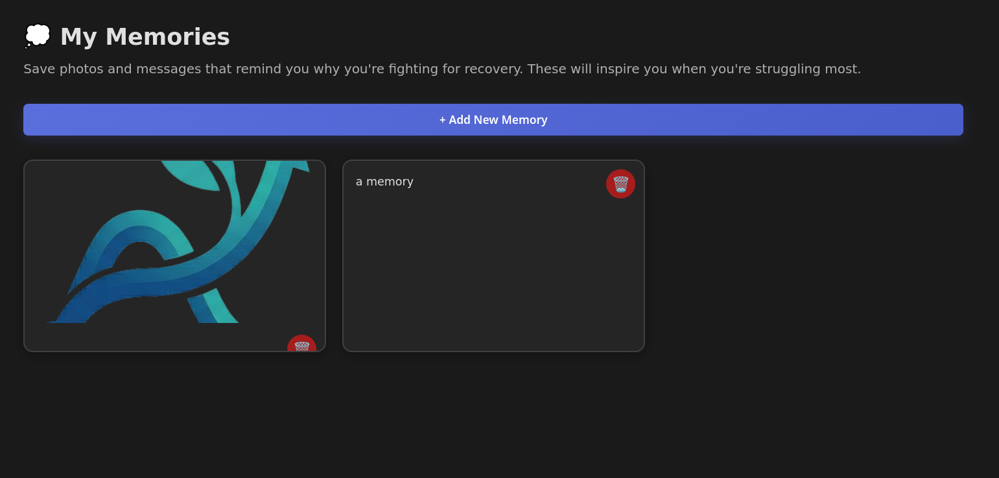
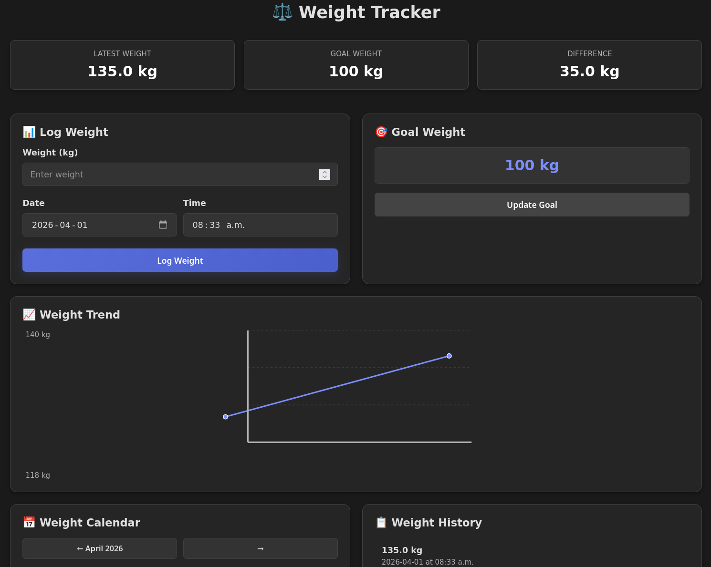
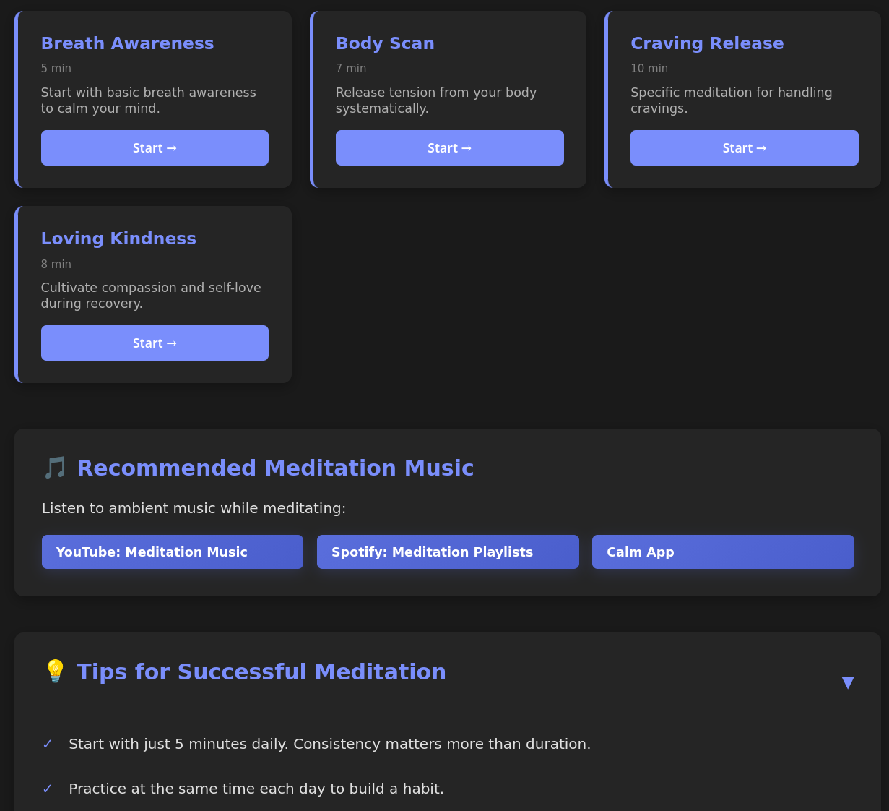

# 🎯 Back on Track - Recovery Companion

Your personal addiction recovery companion. A comprehensive Node.js + React application for tracking your recovery journey, providing a holistic support system to monitor progress, stay motivated, and maintain emotional well-being.

---

### 📊 Project Status

[](https://github.com/nocatix/nocts-back-on-track/actions/workflows/publish-ghcr.yml)
[](https://nodejs.org/)
[](https://react.dev/)
[](https://www.mongodb.com/)
[](https://expressjs.com/)
[](https://www.docker.com/)
[](https://github.com/nocatix/nocts-back-on-track/pkgs/container/nocts-back-on-track-backend)
[](LICENSE)

---

## 🌟 Core Features

### **Dashboard & Tracking**
* 🏠 **Recovery Dashboard** - Overview of all tracked addictions with:
  - Daily savings and progress predictions
  - Withdrawal stage with difficulty indicators
  - Random motivational quotes for daily inspiration
* ➕ **Add Addiction** - Track any of 15+ addiction types with:
  - Addiction type with emoji indicators
  - Date and time when stopped (format adapts to user's locale preference)
  - Addiction-specific frequency measurements (drinks/day, grams/day, hours/day, etc.)
  - Addiction-specific cost units ($/drink, $/gram, $/hour, etc.)
  - Personal notes and triggers
* 📊 **Individual Addiction Pages** - Detailed tracking for each addiction:
  - Days stopped counter (automatically calculated)
  - Total money saved (calculated daily)
  - Withdrawal timeline with day-by-day milestones and difficulty ratings:
    - Color-coded difficulty indicators (Extreme → Very Low)
    - Specific withdrawal symptoms for each day
  - Personalized recovery tips based on addiction type
  - "I Caved" button for tracking relapse events (full-width, dark red)
  - Achievement tracking per addiction

### **Crisis Support & Motivation**
* 🚨 **"I'm About to Cave" Support** - Emergency button that:
  - Shows encouraging motivational message
  - Displays random saved memory (photo/message) for emotional support
  - Offers options to track craving management
  - Quick access to addiction logging if needed
* 💭 **Memories** - Save motivational photos and messages to view during cravings
  - Upload photos (optional)
  - Write inspirational messages (optional)
  - Either alone or combined

### **Mood & Emotional Well-being**
* 🎭 **Mood Tracker** - Comprehensive emotion tracking with:
  - Emotion wheel with 8 primary emotions (Happy, Sad, Angry, Anxious, Calm, Energetic, Tired, Neutral)
  - 5 secondary emotions per primary emotion with color gradients
  - Intensity slider (1-5 scale)
  - Trigger identification
  - Personal notes
  - Monthly calendar view with color-coded moods
  - Emoji indicators for quick visual reference

### **Lifestyle Tracking**
* 📔 **Recovery Diary** - Write reflections with:
  - Markdown formatting support
  - Markdown formatting tips (collapsible)
  - "Journaling Tips for Recovery" bento box (collapsible)
  - Encrypted storage for privacy
* ⚖️ **Weight Tracker** - Monitor physical health with:
  - Weight logging with imperial/metric unit preference
  - Goal weight setting and progress tracking
  - Monthly calendar with weigh-ins
  - Weight history with delete option
  - SVG graphs showing weight progression
  - Unit preference from profile settings

### **Meditation & Mindfulness**
* 🧘 **Guided Meditations** - Mental health support with:
  - Multiple meditation tips (collapsible)
  - Embedded music player for ambient sounds
  - Meditation guide sections
  - Pre-recorded meditation recommendations

### **Games & Activities**
* 🎮 **Craving Game** - Productive distraction during cravings:
  - Wordle-style 5-letter word guessing
  - 550+ English language words
  - 6 attempts per game
  - Collapsible "How to Play" instructions
  - Perfect for occupying the mind during urges

### **Achievements & Motivation**
* 🏆 **Trophy System** - Cumulative milestones for recovery:
  - **Daily Trophies** (Days 1-6)
  - **Weekly Trophies** (Weeks 1-3 after day 6)
  - **Monthly Trophies** (Months 1-11 after week 3)
  - **Yearly Trophies** (Year 1+)
  - Progress tracking showing current trophy + next milestone
* 🎖️ **Achievements** - Per-addiction milestones:
  - 1 week, 1 month, 3 months, 6 months, 1 year per addiction
  - Automatic achievement notifications

### **User Experience**
* 👤 **Profile Management** - Full user control:
  - Edit full name
  - Change password with validation
  - Delete account option
  - Measurement preference (Imperial/Metric) affecting:
    - Weight tracker units
    - Time format (12h with AM/PM vs 24h)
    - All measurements across the app
* 🔒 **Privacy Policy** - Transparent data practices documentation:
  - Open source, no ads, no tracking commitment
  - Data collection overview
  - Security practices and encryption details
* 🎨 **Dark Mode** - Full dark/light mode support with:
  - System preference detection
  - Manual toggle in sidebar
  - Consistent theming across all pages
  - Color-coded elements based on addiction type
* 💾 **Cookie Persistence** - Settings saved locally:
  - Login information (token)
  - Dark mode preference
  - Sidebar collapsed state
  - Hint collapse states per page
* 📱 **Responsive Design** - Mobile, tablet, and desktop optimized
* ℹ️ **Why Use This** - Educational page explaining:
  - Science behind recovery tools
  - Benefits of meditation, mood tracking, journaling
  - Weight tracking motivation
  - Recovery statistics

### **Supported Addiction Types**
🍺 Alcohol • 🌿 Cannabis • 💉 Hard Drugs • 🚬 Nicotine • 🎰 Gambling • 📱 Social Media • 📰 Doomscrolling • 🎮 Video Games • 🔞 Pornography • 🛍️ Shopping • 🍬 Sugar • ☕ Coffee • 🍽️ Overeating • ❓ Other (15 total)

*Each addiction type includes:*
- Customized withdrawal timeline (7-180+ days)
- Daily difficulty ratings (color-coded)
- Specific withdrawal symptom descriptions
- Addiction-specific recovery tips

## 📸 Screenshots

<div align="center">

### Dashboard


### Addiction Detail & Tracking



### Mood Tracker


### Diary


### Memories


### Weight Tracker


### Meditation


</div>

## 🛠️ Technical Stack

### **Backend**
- **Runtime**: Node.js with Express.js
- **Database**: MongoDB with Mongoose ODM
- **Authentication**: JWT (JSON Web Tokens) with bcryptjs password hashing
- **Security**: Helmet.js for security headers, HTTPS enforcement, AES-256-GCM encryption for sensitive data
- **API**: RESTful architecture with modular route structure

### **Frontend**
- **Framework**: React with React Router for navigation
- **HTTP Client**: Axios with automatic token authentication
- **Styling**: Custom CSS with CSS variables for dynamic theming
- **Dark Mode**: System preference detection + manual toggle
- **State Management**: React Context API for auth, dark mode, and user preferences
- **Charts/Graphs**: SVG-based data visualization for weight and mood tracking

## 🚀 Getting Started

### Prerequisites
- **Node.js** v14+ ([Download](https://nodejs.org))
- **npm** (comes with Node.js)
- **MongoDB** v4.4+ (local or [Atlas](https://www.mongodb.com/cloud/atlas))

### Installation Steps

#### 1. Clone & Setup
```bash
cd nocts-back-on-track
cp .env.example .env
```

#### 2. Configure Environment (.env)
```bash
# Database
MONGODB_URI=mongodb://localhost:27017/nocts-back-on-track

# Authentication
JWT_SECRET=your_secure_random_key_here

# Security
ENCRYPTION_KEY=<run: node -e "console.log(require('crypto').randomBytes(32).toString('hex'))">
NODE_ENV=development

# Server
PORT=5000
CLIENT_URL=http://127.0.0.1:3000
```

#### 3. Install Dependencies
```bash
# Install all dependencies
npm install
```

#### 4. Start Development Servers

**Terminal 1 - Backend:**
```bash
npm run dev
# Runs on http://127.0.0.1:5000
```

**Terminal 2 - Frontend:**
```bash
cd client
npm start
# Runs on http://127.0.0.1:3000
```

### Docker Setup (Alternative)
```bash
distrobox enter
docker-compose up
```

### Docker with GHCR Images (Production)
Pull pre-built images from GitHub Container Registry:

```bash
# Create local docker-compose.yml with GHCR images
curl -O https://raw.githubusercontent.com/nocatix/nocts-back-on-track/main/docker-compose-ghcr.yml

# Start with published images
docker compose -f docker-compose-ghcr.yml up
```

Or use this configuration:

```yaml
services:
  backend:
    image: ghcr.io/nocatix/nocts-back-on-track-backend:latest
    ports:
      - "5000:5000"
    environment:
      MONGODB_URI: mongodb://mongo:27017/nocts-back-on-track
      JWT_SECRET: your_secure_random_key_here
      ENCRYPTION_KEY: your_encryption_key
      NODE_ENV: production
    depends_on:
      - mongo

  frontend:
    image: ghcr.io/nocatix/nocts-back-on-track-frontend:latest
    ports:
      - "3000:3000"
    depends_on:
      - backend

  mongo:
    image: mongo:7.0
    ports:
      - "27017:27017"
    volumes:
      - mongodb_data:/data/db

volumes:
  mongodb_data:
```

**Available Versions:** Check [GHCR Backend](https://github.com/nocatix/nocts-back-on-track/pkgs/container/nocts-back-on-track-backend) and [GHCR Frontend](https://github.com/nocatix/nocts-back-on-track/pkgs/container/nocts-back-on-track-frontend)

## 🔐 Security Features

- ✅ **AES-256-GCM Encryption** for sensitive data at rest
- ✅ **JWT Authentication** with secure token storage
- ✅ **Bcryptjs Hashing** for passwords (salt rounds: 10)
- ✅ **HTTPS Enforcement** in production with local network exceptions
- ✅ **Security Headers** via Helmet.js
- ✅ **CORS Protection** with origin validation
- ✅ **HTTP-Only Cookies** for development environment
- ✅ **encrypted Data Fields**: Diary entries, mood notes, addiction notes, memory messages

See [SECURITY.md](SECURITY.md) for detailed security documentation.

## 📚 Usage Guide

1. **Register**: Create account with username and password
2. **Add Addiction**: Choose addiction type, set start date/time, frequency, and cost
3. **Track Recovery**: Watch days counter and money saved increase automatically
4. **View Timeline**: See withdrawal symptoms and recovery tips adapted to your timeline
5. **Use Support Tools**: 
   - Meditate when anxious
   - Track mood patterns
   - Journal daily reflections
   - Log weight for motivation
   - Play craving game to distract during urges
   - View memories for emotional support
6. **Collect Trophies**: Earn daily/weekly/monthly/yearly trophies for sustained recovery
7. **Celebrate Achievements**: Get notifications and badges for milestones

## 🎯 Recovery Features Explained

### Why Mood Tracking?
Recognizing emotional patterns helps identify relapse triggers early. Studies show 30% better outcomes with emotional tracking + recovery treatment.

### Why Journaling?
Writing processes emotions and identifies coping patterns. Research shows expressive writing reduces anxiety and increases clarity on triggers.

### Why Weight Tracking?
Physical health is mental health. Exercise-focused weight tracking increases motivation 25% and provides visible recovery progress.

### Why Meditation?
Meditation reduces cravings by 25%, manages stress response, and helps rebuild reward pathways damaged by addiction.

### Why Memories?
Visual + emotional anchors provide immediate motivation when willpower is lowest. Seeing photos/messages of goals and support reduces relapse impulses.

## 🤝 Contributing

Contributions welcome! Feel free to fork this project and submit pull requests for any improvements.

## 📄 License

MIT License - See [LICENSE](LICENSE) file for details

## Note from the Developer

Hey. So I made this project because I was fed up with all the available addiction tracking tools. They all contain ads, promotions, or tracking or some other form of shenanigans. I wanted something that is free, strong, and secure. You know I am going through addiction recovery myself. I was heavily abused as a child, both at home and at school. It was not until a little over 2 years ago that it all became too much and I crashed. All of the unsolved trauma suddenly came flooding back. I have C-PTSD and AuDHD. I know that now. Before the crash I already noticed an increase in my addictive habits. During the crash and post crash these addictions became stronger. Luckily I found a good psychologist right before the crash. They were able to help me. It was a long and painful journey that was ahead of me back then. Things are now still not great, but they are a lot better than they probably ever were, even with the addictions. This recovery tracker helps me to get back on track. And maybe it can help you, too!

## 💝 Support

If you find this project helpful in your recovery journey, consider supporting the developer:

[](https://ko-fi.com/noct1)

Your support helps maintain and improve this recovery tool for everyone.